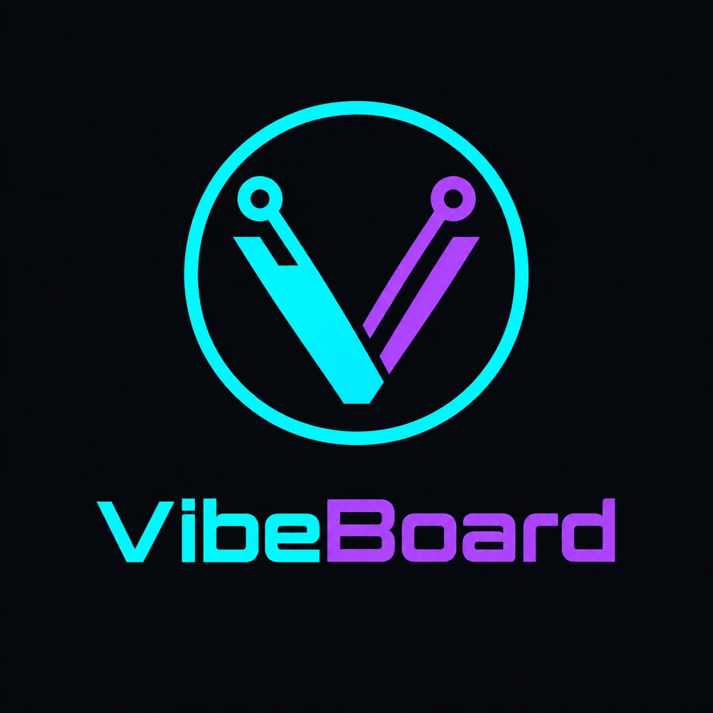
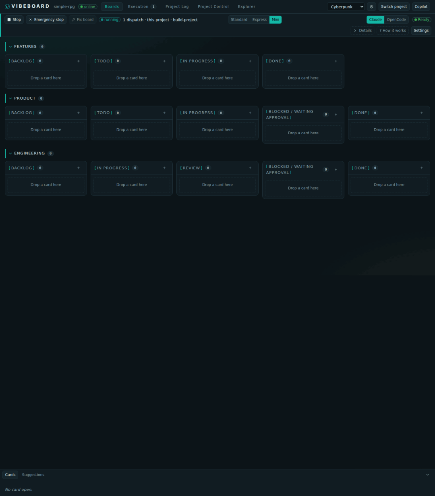

<p align="center">
  
</p>

<p align="center">
  <strong>A local cockpit for building software with AI agents, on a kanban board made of markdown files.</strong>
</p>

<p align="center">
  Status: <strong>Beta</strong> · <a href="LICENSE">PolyForm Shield 1.0.0</a>
</p>

> VibeBoard was inspired by **Adam Awan**. Thanks for the spark that set it in motion.

<p align="center">
  
  <br>
  <em>Auto-pilot in Mini mode building a small game: 44 cards in 36 minutes, shown in 24 seconds.</em>
</p>

## What is VibeBoard

VibeBoard is a self-hosted web app for running a software project with AI coding agents. You plan on
three linked kanban boards (features, the stories under them, and the tasks under those) and agents
do the work, each one inside a Docker container.

The boards are not a database. Every card is a markdown file, and its column is the folder it sits
in. Drag a card and its file moves; edit the file and the board updates. Your project stays plain
text: readable in any editor, versioned with git alongside your code.

VibeBoard drives the AI CLIs you already use, Claude Code or OpenCode, with the login you already
have. It stores no API keys and sends no telemetry.

## What it does

- **Auto-pilot builds the project.** In Mini mode, the default, one agent plans the whole project on
  the board and builds it, then a second reviews, tests and fixes it, closing the cards it verified.
  Standard and Express modes give every card a run and a review of its own.
- **Skills run by hand.** Break a feature into stories, build a story, check a task. A run moves its
  card to In Progress, then to Waiting approval, so you see what needs you.
- **A copilot chat** beside the board, with switchable backend, model and effort.
- **A setup wizard** that asks what you are building, suggests a stack and writes the documents
  auto-pilot works from.
- **Costs on every run:** money, time and tokens, summed per card and project.
- **Oversight:** a dashboard of every run, an append-only project log, and three
  levels of stop, up to killing every agent in the project.

## Getting started

### Prerequisites

- **Docker.** Every agent runs in a container, and there is no fallback. Without Docker the board
  works but no agent starts. Linux and macOS are supported; native Windows is not, yet.
- **Node.js 20.12 or later.**
- **Claude Code or OpenCode**, installed and signed in. Pick a model that supports tool use.

### Install and run

```bash
git clone https://github.com/EderBorella/vibeboard.git
cd vibeboard
npm install
npm run build
npm start
```

Open <http://localhost:4610>. The first start builds the agent image, which takes a few minutes
once and nothing after that.

The first browser to open the board signs itself in, with no token to copy. Any other browser has to
be allowed from one that is already signed in.

From there, open a project folder, or start a new one with the setup wizard.

### Configuration

Settings are environment variables, listed with their defaults in [`.env.example`](.env.example).
Copy it to `.env` and VibeBoard loads it on start.

VibeBoard binds to `127.0.0.1` by default. `VIBEBOARD_HOST=0.0.0.0` opens it to your network, and
anyone you allow in can drive agents with your CLI credentials. Do that only on a network you trust,
and never on the public internet.

### Development

```bash
npm run dev       # server with reload
npm run web:dev   # Vite with hot reload, proxying the API
npm test          # the unit suite
npm run check     # typechecks and source gates
```

## Architecture

The server is one Node.js process: Fastify serves the API, a WebSocket and the React UI on one port.
A file watcher pushes every change live, so an agent's move and your drag are one event.

- **`src/core`** makes the decisions, with no I/O. Auto-pilot's next step comes from a deterministic
  state machine, never from a prompt.
- **`src/store`** reads and writes the card files, config and run records.
- **`src/server`** has the routes, one table of who may call each, and the agent runner.
- **`src/service`** is the auto-pilot loop, a separate process that reaches the board only over HTTP.
- **`web`** is React 19 and Vite, built in atomic layers.

Each project gets one container per backend. The project is mounted writable, `.vibeboard/` and
git's hooks and config read-only, and nothing else on your disk. Agents change the board
through the API with a per-card credential, and cannot reach your local network.

## Wiki

The full documentation is moving to the [wiki](https://github.com/EderBorella/vibeboard/wiki): the
card format, skills, the auto-pilot modes, configuration and the security model. It is being
written. Until it lands, the security model is in [`docs/security/model.md`](docs/security/model.md).

## Contact and support

Found a bug or have an idea? Open an [issue](https://github.com/EderBorella/vibeboard/issues). I keep
an eye on them. For anything else, message me on [GitHub](https://github.com/EderBorella) or
[LinkedIn](https://www.linkedin.com/in/eder-borella/).
